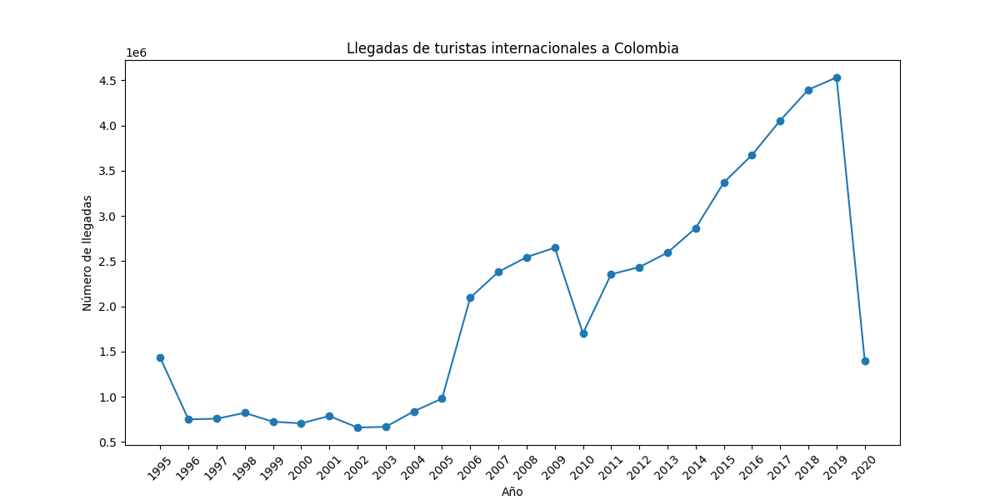
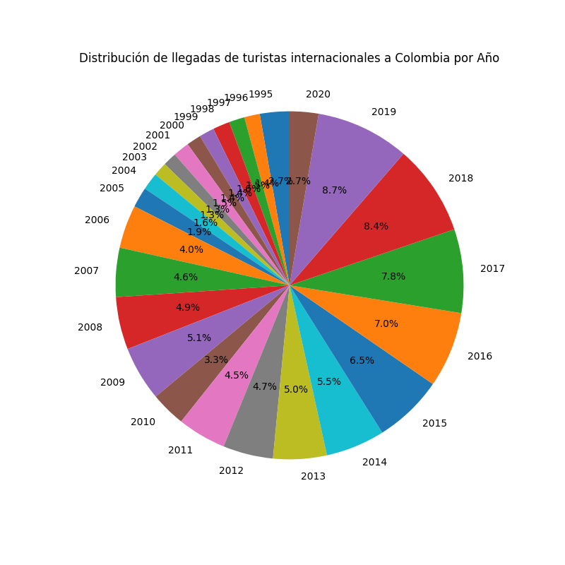

# Proyecto de Turismo en Colombia

## Descripción

Este proyecto es una aplicación web interactiva que permite visualizar datos de turismo en Colombia. La aplicación ofrece dos gráficos para analizar las llegadas de turistas internacionales y presenta una lista de destinos turísticos populares con descripciones e imágenes. Los datos son presentados de forma visual mediante gráficos de línea y torta, facilitando el análisis de las tendencias de llegadas por año.

## Características

- **Gráfico de línea**: Muestra la evolución de las llegadas de turistas internacionales a Colombia a lo largo de los años.
- **Gráfico de torta**: Presenta la distribución de llegadas de turistas por año en formato de gráfico circular.
- **Listado de sitios turísticos**: Incluye una lista de destinos populares en Colombia, con una breve descripción y una imagen asociada para cada ciudad.
  
## Tecnologías utilizadas

- **Flask**: Framework web para el desarrollo de la aplicación.
- **Pandas**: Para el manejo y procesamiento de los datos en formato CSV.
- **Matplotlib**: Para la generación de gráficos visuales.
- **HTML/CSS**: Para la creación de las plantillas web.
  
## Requisitos

- Python 3.x
- Flask
- Pandas
- Matplotlib

## Instalación

1. Clona este repositorio en tu máquina local:

    ```bash
    git clone https://github.com/tu_usuario/tu_repositorio.git
    ```

2. Navega al directorio del proyecto:

    ```bash
    cd tu_repositorio
    ```

3. Crea un entorno virtual y actívalo:

    ```bash
    python -m venv venv
    source venv/bin/activate  # En Linux/Mac
    venv\Scripts\activate     # En Windows
    ```

4. Instala las dependencias necesarias:

    ```bash
    pip install -r requirements.txt
    ```

## Uso

1. Ejecuta la aplicación Flask:

    ```bash
    python app.py
    ```

2. Accede a la aplicación a través de tu navegador en `http://127.0.0.1:5000/`.

3. Navega a la ruta `/analytics` para ver los gráficos y la lista de sitios turísticos.

## Contribuciones

Las contribuciones son bienvenidas. Si tienes ideas para mejorar el proyecto o encuentras algún error, por favor abre un *issue* o un *pull request*.

## Licencia

Este proyecto está bajo la Licencia MIT. Ver el archivo [LICENSE](LICENSE) para más detalles.

---

## Imágenes de ejemplo

### Gráfico de Llegadas de Turistas



### Gráfico de Distribución de Llegadas por Año


